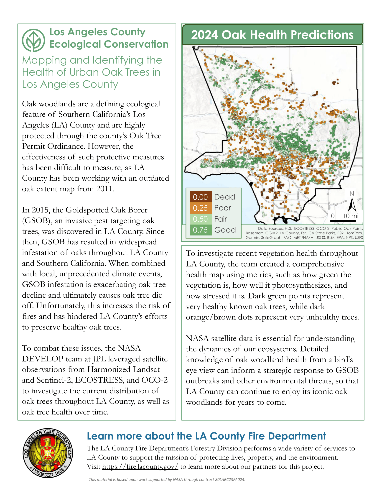
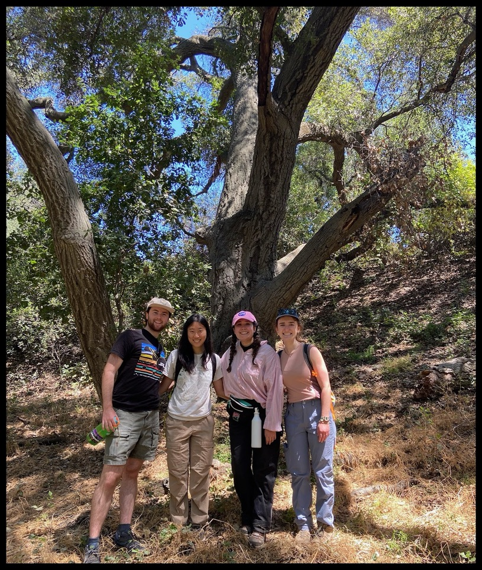

## About the Project

In the summer of 2025, I had the opportunity to be a part of the NASA DEVELOP Los Angeles County Ecological Conservation Project. We partnered with the Los Angeles County Fire Department’s Forestry Division and the Department of Internal Services to address critical concerns regarding local oak trees. It was an honor working with such passionate and knowledgeable people while exploring new ways to assess oak tree and oak woodland health remotely. To learn more about current threats to oak trees and how our findings support local strategic land management tactics, explore the figures below or check out our presentation.

## Project Overview

{fig-alt="Slide show which includes figures and graphs related to the team's findings." fig-align="center"}

## The Dangers Oak Trees Face and 2024 Oak Tree Health Predictions

{fig-alt="The figure displays a map of Los Angeles County and colored points to represent predicted tree health and location. The text surrounding the figure in the poster details the specific risks the oak trees face, as well as the tools the team utilized to generate oak health predictions." fig-align="center"}

## Methodology Summary

{fig-alt="The poster includes details on the specific Earth sensing tools we utilized. In addition to an overview of our approach and findings. There are many different images of graphs, maps, and Earth sensing tools on the poster." fig-align="center"}

{fig-alt="Four individuals in their early-mid twenties wearing hiking gear, smiling and standing underneath a massive oak tree." fig-align="center"}

###### ***Note: The technical report associated with this project is currently under internal review before it can be made public. This material is based upon work supported by NASA through contract 80LARC23FA024.***
